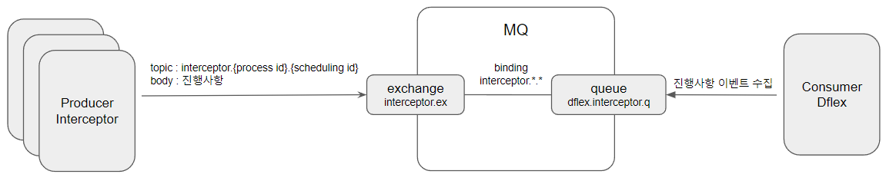

# MQ Sample
* MQ 설치
  1. docker로 rabbitmq:3-management run
      ``` 
      $ docker run -d --name dflex-rabbit 
          -p 5672:5672 -p 15672:15672 
          rabbitmq:3-management
      ```
  2. 관리자 페이지 접근
      ``` 
      http://host-ip:15672
      ```
  3. guest로 로그인
     - id : guest
     - pw : guest
  4. 유저 생성
     - 'dacon' 유저 생성
       - 권한: administrator
     - 'dflex' 유저 생성
       - 권한: x
  5. guest 계정 삭제
     - 'dacon'계정으로 로그인 후 guest 계정 삭제
  6. vhost 만들기
     - 'dflex-host' 생성
  7. 'dflex-host' 접근 권한
     - 'dflex' 유저에 모든 권한 부여
* MQ 구성
  - 
* 설치
  ``` 
  pip install pika
  pip install python-dotenv
  ```
* `.env` 설정
  - .env 파일 생성후 아래 내용 세팅
  ```
  RABBIT_MQ_ID={mq id}
  RABBIT_MQ_PASSWORD={mq 비번}
  RABBIT_MQ_VHOST={vhost name}
  RABBIT_MQ_HOST={mq local-ip or localhost}
  RABBIT_MQ_PORT={mq port or default : 5672}
  ```
* 실행
  ``` 
  $ python consumer.py
  $ python producer.py interceptor.p1.s1
  $ python producer.py interceptor.p1.s2
  $ python producer.py interceptor.p1.s3
  $ python producer.py interceptor.p2.s1
  $ python producer.py interceptor.p2.s2
  $ python producer.py interceptor.p2.s3
  ```